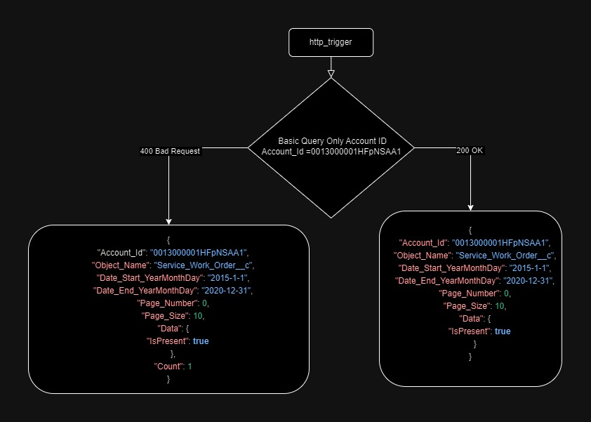
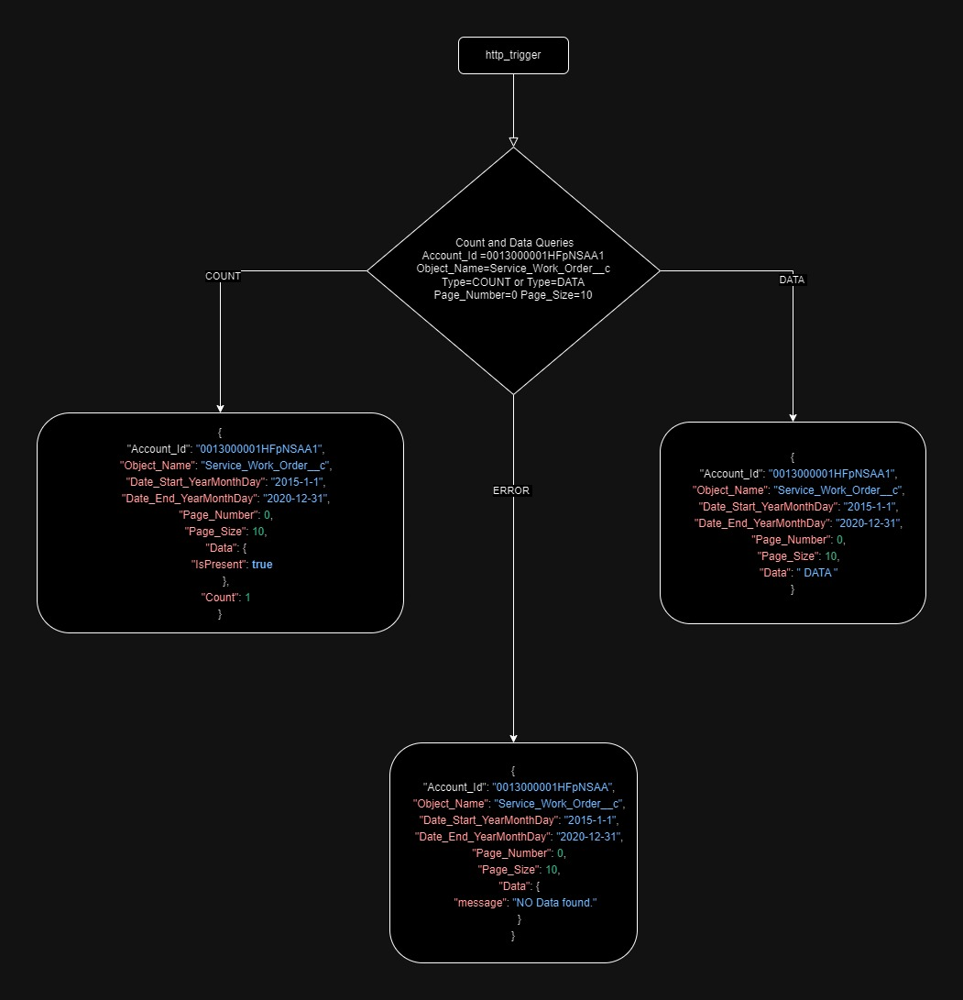

## **Azure Function App Documentation**

### **Introduction**

This documentation provides an overview of the Azure Function App implemented in the **function\_app.py** file. The Function App serves as an interface to a SQL Server database, allowing users to execute count and data queries via HTTP requests.

### **File Structure**

- **function\_app.py** : Contains the main code for the Azure Function App.
- **sql\_data\_fetcher.py** : Defines the **SqlDataFetcher** class responsible for executing SQL queries.
- **validation.py** : Contains the **Validation** class for parameter validation.

### **Key Components**

- **Imports and Logging Setup:**
  - Necessary modules are imported, including **azure.functions** , **json** , **Validation** , and **SqlDataFetcher**.
  - Logging is configured to record debugging information.
- **Connection String and Data Fetcher Initialization:**
  - A connection string for the SQL Server database is defined.
  - An instance of **SqlDataFetcher** is created using the connection string.
- **FunctionApp Initialization:**
  - An instance of **func.FunctionApp()** is created for the Azure Function.
- **Error Handling Function:**
  - **log\_error\_and\_return\_response** logs an error message and returns an HTTP response with the error details.
- **Query Parameter Validation:**
  - The **validate\_query\_params** function validates various query parameters using a **Validation** object.
- **Query Execution Function:**
  - The **execute\_query** function executes SQL queries based on query parameters and type ('COUNT' or 'DATA').
- **HTTP Trigger Function:**
  - **http\_trigger** is the main entry point triggered by HTTP requests.
  - It extracts, validates, and processes query parameters, then formats the results into a JSON response.
- **SqlDataFetcher Class:**
  - Handles SQL query execution using **pyodbc**.
  - Methods: **execute\_count\_query** , **execute\_data\_query** , **\_build\_count\_query** , **\_build\_data\_query**.
- **QueryParameters Class:**
  - Represents parameters used in SQL queries.
  - Provides a method ( **transform** ) to transform parameters for use in queries.
- **Validation Class:**
  - Provides validation methods for different query parameters.
- **Constants:**
  - **VALID\_OBJECT\_NAMES** : List of valid object names used for validation.

### **Usage**

- **Azure Function Configuration:**
  - Deploy the Azure Function App and configure the necessary settings, such as the connection string.
- **HTTP Requests:**
  - Make HTTP requests to the provided endpoint with the required parameters ( **Account\_Id** , **Type** , **Object\_Name** , etc.).
- **Response Format:**
  - The Function App responds with JSON data containing query results or error messages.

### **Notes**

- Ensure proper security measures, such as authentication and authorization, are implemented based on your deployment requirements.
- Review and adapt the code based on specific business logic and database schema.

### **Conclusion**

The Azure Function App provides a flexible and scalable solution for executing SQL queries on a Microsoft SQL Server database through HTTP requests. Users can tailor queries based on various parameters, making it suitable for a range of applications.

### **Example Requests for Azure Function App**

Here are examples of HTTP requests for interacting with the Azure Function App. The Function App serves as an interface to a SQL Server database, allowing users to execute count and data queries based on specified parameters.

#### Request 1: Basic Query

**Command:**

curl --location 'https://func3-smb-sfda-dev.azurewebsites.net/api/sm\_azure\_query?code=PeCw2qwxEiyjLDJZ8LnVbX5V5jd5yVmSA\_cNn0IvlJr3AzFu4KYzYA%3D%3D&Account\_Id=0013000001HFpNSAA1'



**Description:**

- Executes a basic query without specifying **Object\_Name** , **Type** , or date range.
- Defaults for **Date\_Start\_YearMonthDay** , **Date\_End\_YearMonthDay** , **Page\_Number** , and **Page\_Size** are used.

#### Request 2: Count and Data Queries

**Command (Count):**

curl --location 'https://func3-smb-sfda-dev.azurewebsites.net/api/sm\_azure\_query?code=PeCw2qwxEiyjLDJZ8LnVbX5V5jd5yVmSA\_cNn0IvlJr3AzFu4KYzYA%3D%3D&Account\_Id=0013000001HFpNSAA1&Object\_Name=Service\_Work\_Order\_\_c&Type=COUNT'

**Command (Data):**
curl --location 'https://func3-smb-sfda-dev.azurewebsites.net/api/sm\_azure\_query?code=PeCw2qwxEiyjLDJZ8LnVbX5V5jd5yVmSA\_cNn0IvlJr3AzFu4KYzYA%3D%3D&Account\_Id=0013000001HFpNSAA1&Object\_Name=Service\_Work\_Order\_\_c&Type=DATA'

**Description:**

- Executes count and data queries for the specified **Object\_Name** ( **Service\_Work\_Order\_\_c** ).



#### Request 3: Detailed Query with Date Range and Pagination

**Command:**

curl --location 'https://func3-smb-sfda-dev.azurewebsites.net/api/sm\_azure\_query?code=PeCw2qwxEiyjLDJZ8LnVbX5V5jd5yVmSA\_cNn0IvlJr3AzFu4KYzYA%3D%3D&Account\_Id=0013000001HFpNSAA1&Object\_Name=Service\_Work\_Order\_\_c&Type=DATA&Date\_Start\_YearMonthDay=2015-1-1&Date\_End\_YearMonthDay=2020-12-31&Page\_Number=0&Page\_Size=10'

**Description:**

- Executes a data query for the specified **Object\_Name** ( **Service\_Work\_Order\_\_c** ) with a date range and pagination.
- **Date\_Start\_YearMonthDay** and **Date\_End\_YearMonthDay** are set to filter data from January 1, 2015, to December 31, 2020.
- **Page\_Number** is set to 0, and **Page\_Size** is set to 10 for pagination.

**Response**
Response Status: 200 OK
```
{
    "Account_Id": "0013000001HFpNSAA1",
    "Object_Name": "Service_Work_Order__c",
    "Date_Start_YearMonthDay": "2015-1-1",
    "Date_End_YearMonthDay": "2020-12-31",
    "Page_Number": 0,
    "Page_Size": 10,
    "Data": "[{\"Year_p\": \"Year=2015\", \"Month_p\": \"Month=01\", \"Day_p\": \"Day=16\", \"Id\": \"a0Z30000008LBUqEAO\", \"IsDeleted\": false, \"Name\": \"WO-6375266\", \"RecordTypeId\": null, \"CreatedDate\": \"2014-06-28 12:03:29\", \"CreatedById\": \"00530000009WGjPAAW\", \"LastModifiedDate\": \"2024-01-10 09:26:59\", \"LastModifiedById\": \"0058I0000032JPJQA2\", \"SystemModstamp\": \"2024-01-10 09:26:59\", \"LastActivityDate\": null, \"LastViewedDate\": null, \"LastReferencedDate\": null, \"Service_Agreement__c\": \"a0Y3000000AoUMhEAN\", \"Additional_Services_Windows_Cleaning__c\": 0.0, \"Amount_Due__c\": null, \"Balance__c\": 0.0, \"Cancellation_Reason__c\": null, \"Count__c\": 1.0, \"Customer_Address__c\": \"27w183 Chestnut Ln Winfield IL 60190\", \"Customer_Mobile__c\": \"(630) 306-9899\", \"Customer_Name__c\": \"Frank Acton\", \"Customer_Phone__c\": \"(630) 253-4755\", \"Date_Saturday__c\": null, \"Day_of_Visit_Formula__c\": \"Friday\", \"Day_of_Visit__c\": null, \"Discounts_All__c\": 0.0, \"Discounts_First_Time__c\": 0.0, \"Discounts_R1__c\": 0.0, \"Discounts_R2__c\": 0.0, \"Discounts__c\": 0.0, \"Driving_Directions__c\": null, \"ETL_ID__c\": null, \"Fee_Adjustment__c\": null, \"Fee_Amount__c\": null, \"Fee_Balance__c\": null, \"Fee_Received__c\": null, \"Fee_Sales_Tax__c\": 0.0, \"Fee_Sub_Total__c\": 0.0, \"First_Time_In_Discount__c\": null, \"First_Time_In_Grand_Total__c\": 0.0, \"First_Time_In_Sales_Tax__c\": 0.0, \"First_Time_In_Sub_Total__c\": null, \"First_Time_in_Fee__c\": null, \"Home_Entry_Method__c\": \"Customer is Home\", \"Location_Code__c\": \"4663\", \"Location_Id__c\": \"a0L3000000QLut9\", \"Lockout_Amount__c\": null, \"Lockout_Fee__c\": null, \"Lockout__c\": false, \"MMA_Discount_All__c\": null, \"MMA_Discount_R1__c\": null, \"MMA_Discount_R2__c\": null, \"MMA_Discount__c\": null, \"MMA_First_Time_In_Discount__c\": null, \"MapQuest_Miles__c\": 0.0, \"Not_Before__c\": \"24:00\", \"Open_Date__c\": null, \"Open_Record__c\": 0.0, \"Original_Schedule_Date__c\": null, \"Out_by__c\": \"13:00\", \"Payroll_Amount__c\": 0.0, \"Payroll_Items__c\": 0.0, \"Price__c\": null, \"Quarters__c\": null, \"Rescheduled_Reason__c\": \"Skip Early\", \"Rotation__c\": \"Rotation 1\", \"Sales_Rep_Discount_All__c\": null, \"Sales_Rep_Discount_R1__c\": null, \"Sales_Rep_Discount_R2__c\": null, \"Sales_Rep_Discount__c\": null, \"Sales_Tax__c\": 0.0, \"Service_Date__c\": \"2015-01-16 00:00:00\", \"Service_Type__c\": \"House\", \"Service_Zone__c\": \"240\", \"Services__c\": null, \"Special_Attention__c\": null, \"Status__c\": \"Final - Cancelled\", \"Sub_Total_All__c\": 0.0, \"Sub_Total_First_Time__c\": 0.0, \"Sub_Total_R1__c\": 0.0, \"Sub_Total_R2__c\": 0.0, \"Sub_Total__c\": 0.0, \"Time_In_Text__c\": null, \"Time_In__c\": null, \"Time_Out_Hours__c\": null, \"Time_Out_Minutes__c\": null, \"Time_Out_Text__c\": null, \"Time_Out__c\": null, \"Time_Spent_New__c\": null, \"Time_Spent_Text__c\": null, \"Time_Spent__c\": null, \"Time__c\": \"08:00\", \"Time_in_Hours__c\": null, \"Time_in_Minutes__c\": null, \"Total_Amount_Due__c\": 0.0, \"Total_Due_Trigger__c\": 0.0, \"Total_Grand_Total_All__c\": 0.0, \"Total_Grand_Total_R1__c\": 0.0, \"Total_Grand_Total_R2__c\": 0.0, \"Total_Revenue__c\": \"Total Revenue\", \"Total_Sales_Tax_All__c\": 0.0, \"Total_Sales_Tax_R1__c\": 0.0, \"Total_Sales_Tax_R2__c\": 0.0, \"Total_Sub_Total_All__c\": null, \"Total_Sub_Total_R1__c\": null, \"Total_Sub_Total_R2__c\": null, \"Total__c\": 0.0, \"Type__c\": \"2-Week\", \"Use_Sales_Tax_Rate__c\": null, \"Verified__c\": false, \"Visit_Order__c\": 0.0, \"Work_Team__c\": \"a0i30000009jLiSAAU\", \"per_Qtr__c\": 0.0, \"No_of_team_members_worked__c\": 2.0, \"Total_Rooms__c\": 0.0, \"isFirst__c\": false, \"Total_Miles__c\": 0.0, \"Customer_Start_Date__c\": \"2013-05-24 00:00:00\", \"Autogenerated__c\": true, \"Total_Quarters__c\": 0.0, \"Actual_Quarters__c\": null, \"Legacy_Other_Services__c\": false, \"Account__c\": \"0013000001HFpNSAA1\", \"Customer_Id__c\": \"0013000001HFpNS\", \"Time_In_Out__c\": null, \"Service_Date_Day__c\": \"Friday\", \"Redo_Work_Order__c\": false, \"One_Time__c\": false, \"Service_Agreement_Room_Count__c\": 16.0, \"Commission_Paid__c\": false, \"Customer_Number__c\": \"0000362639\", \"Service_Type_Report__c\": null, \"Employee_Payroll__c\": 0.0, \"Captain__c\": \"Unassigned\", \"Mate__c\": \"Ruthie Leach\", \"Rescheduled_Reason_Trim__c\": \"Skip Early\", \"Service_Type2__c\": \"House\", \"Branch_Code__c\": null, \"Mileage_Sum__c\": 0.0, \"Mileage__c\": 0.0, \"Within_Commission_Date__c\": false, \"After_Service_Agreement_Start_Date2__c\": true, \"Processed_Rooms_Services__c\": true, \"Work_Order_Rooms__c\": \"[{\\\"attributes\\\":{\\\"type\\\":\\\"Work_Order_Room__c\\\",\\\"url\\\":\\\"/services/data/v31.0/sobjects/Work_Order_Room__c/a0e30000003nSA5AAM\\\"},\\\"Work_Order__c\\\":\\\"a0Z30000008LBUqEAO\\\",\\\"Special_Attention__c\\\":false,\\\"Id\\\":\\\"a0e30000003nSA5AAM\\\",\\\"Room_and_Condition__c\\\":\\\"a0X3000000B6CTeEAN\\\",\\\"Cleaned__c\\\":true},{\\\"attributes\\\":{\\\"type\\\":\\\"Work_Order_Room__c\\\",\\\"url\\\":\\\"/services/data/v31.0/sobjects/Work_Order_Room__c/a0e30000003nSAKAA2\\\"},\\\"Work_Order__c\\\":\\\"a0Z30000008LBUqEAO\\\",\\\"Special_Attention__c\\\":false,\\\"Id\\\":\\\"a0e30000003nSAKAA2\\\",\\\"Room_and_Condition__c\\\":\\\"a0X3000000B6CTtEAN\\\",\\\"Cleaned__c\\\":true},{\\\"attributes\\\":{\\\"type\\\":\\\"Work_Order_Room__c\\\",\\\"url\\\":\\\"/services/data/v31.0/sobjects/Work_Order_Room__c/a0e30000003nSA7AAM\\\"},\\\"Work_Order__c\\\":\\\"a0Z30000008LBUqEAO\\\",\\\"Special_Attention__c\\\":false,\\\"Id\\\":\\\"a0e30000003nSA7AAM\\\",\\\"Room_and_Condition__c\\\":\\\"a0X3000000B6CTgEAN\\\",\\\"Cleaned__c\\\":true},{\\\"attributes\\\":{\\\"type\\\":\\\"Work_Order_Room__c\\\",\\\"url\\\":\\\"/services/data/v31.0/sobjects/Work_Order_Room__c/a0e30000003nSA8AAM\\\"},\\\"Work_Order__c\\\":\\\"a0Z30000008LBUqEAO\\\",\\\"Special_Attention__c\\\":false,\\\"Id\\\":\\\"a0e30000003nSA8AAM\\\",\\\"Room_and_Condition__c\\\":\\\"a0X3000000B6CThEAN\\\",\\\"Cleaned__c\\\":true},{\\\"attributes\\\":{\\\"type\\\":\\\"Work_Order_Room__c\\\",\\\"url\\\":\\\"/services/data/v31.0/sobjects/Work_Order_Room__c/a0e30000003nSA9AAM\\\"},\\\"Work_Order__c\\\":\\\"a0Z30000008LBUqEAO\\\",\\\"Special_Attention__c\\\":false,\\\"Id\\\":\\\"a0e30000003nSA9AAM\\\",\\\"Room_and_Condition__c\\\":\\\"a0X3000000B6CTiEAN\\\",\\\"Cleaned__c\\\":true},{\\\"attributes\\\":{\\\"type\\\":\\\"Work_Order_Room__c\\\",\\\"url\\\":\\\"/services/data/v31.0/sobjects/Work_Order_Room__c/a0e30000003nSAAAA2\\\"},\\\"Work_Order__c\\\":\\\"a0Z30000008LBUqEAO\\\",\\\"Special_Attention__c\\\":false,\\\"Id\\\":\\\"a0e30000003nSAAAA2\\\",\\\"Room_and_Condition__c\\\":\\\"a0X3000000B6CTjEAN\\\",\\\"Cleaned__c\\\":true},{\\\"attributes\\\":{\\\"type\\\":\\\"Work_Order_Room__c\\\",\\\"url\\\":\\\"/services/data/v31.0/sobjects/Work_Order_Room__c/a0e30000003nSABAA2\\\"},\\\"Work_Order__c\\\":\\\"a0Z30000008LBUqEAO\\\",\\\"Special_Attention__c\\\":false,\\\"Id\\\":\\\"a0e30000003nSABAA2\\\",\\\"Room_and_Condition__c\\\":\\\"a0X3000000B6CTkEAN\\\",\\\"Cleaned__c\\\":true},{\\\"attributes\\\":{\\\"type\\\":\\\"Work_Order_Room__c\\\",\\\"url\\\":\\\"/services/data/v31.0/sobjects/Work_Order_Room__c/a0e30000003nSACAA2\\\"},\\\"Work_Order__c\\\":\\\"a0Z30000008LBUqEAO\\\",\\\"Special_Attention__c\\\":false,\\\"Id\\\":\\\"a0e30000003nSACAA2\\\",\\\"Room_and_Condition__c\\\":\\\"a0X3000000B6CTlEAN\\\",\\\"Cleaned__c\\\":true},{\\\"attributes\\\":{\\\"type\\\":\\\"Work_Order_Room__c\\\",\\\"url\\\":\\\"/services/data/v31.0/sobjects/Work_Order_Room__c/a0e30000003nSADAA2\\\"},\\\"Work_Order__c\\\":\\\"a0Z30000008LBUqEAO\\\",\\\"Special_Attention__c\\\":false,\\\"Id\\\":\\\"a0e30000003nSADAA2\\\",\\\"Room_and_Condition__c\\\":\\\"a0X3000000B6CTmEAN\\\",\\\"Cleaned__c\\\":true},{\\\"attributes\\\":{\\\"type\\\":\\\"Work_Order_Room__c\\\",\\\"url\\\":\\\"/services/data/v31.0/sobjects/Work_Order_Room__c/a0e30000003nSAEAA2\\\"},\\\"Work_Order__c\\\":\\\"a0Z30000008LBUqEAO\\\",\\\"Special_Attention__c\\\":false,\\\"Id\\\":\\\"a0e30000003nSAEAA2\\\",\\\"Room_and_Condition__c\\\":\\\"a0X3000000B6CTnEAN\\\",\\\"Cleaned__c\\\":true},{\\\"attributes\\\":{\\\"type\\\":\\\"Work_Order_Room__c\\\",\\\"url\\\":\\\"/services/data/v31.0/sobjects/Work_Order_Room__c/a0e30000003nSAFAA2\\\"},\\\"Work_Order__c\\\":\\\"a0Z30000008LBUqEAO\\\",\\\"Special_Attention__c\\\":false,\\\"Id\\\":\\\"a0e30000003nSAFAA2\\\",\\\"Room_and_Condition__c\\\":\\\"a0X3000000B6CToEAN\\\",\\\"Cleaned__c\\\":true},{\\\"attributes\\\":{\\\"type\\\":\\\"Work_Order_Room__c\\\",\\\"url\\\":\\\"/services/data/v31.0/sobjects/Work_Order_Room__c/a0e30000003nSAGAA2\\\"},\\\"Work_Order__c\\\":\\\"a0Z30000008LBUqEAO\\\",\\\"Special_Attention__c\\\":false,\\\"Id\\\":\\\"a0e30000003nSAGAA2\\\",\\\"Room_and_Condition__c\\\":\\\"a0X3000000B6CTpEAN\\\",\\\"Cleaned__c\\\":true},{\\\"attributes\\\":{\\\"type\\\":\\\"Work_Order_Room__c\\\",\\\"url\\\":\\\"/services/data/v31.0/sobjects/Work_Order_Room__c/a0e30000003nSAHAA2\\\"},\\\"Work_Order__c\\\":\\\"a0Z30000008LBUqEAO\\\",\\\"Special_Attention__c\\\":false,\\\"Id\\\":\\\"a0e30000003nSAHAA2\\\",\\\"Room_and_Condition__c\\\":\\\"a0X3000000B6CTqEAN\\\",\\\"Cleaned__c\\\":true},{\\\"attributes\\\":{\\\"type\\\":\\\"Work_Order_Room__c\\\",\\\"url\\\":\\\"/services/data/v31.0/sobjects/Work_Order_Room__c/a0e30000003nSAIAA2\\\"},\\\"Work_Order__c\\\":\\\"a0Z30000008LBUqEAO\\\",\\\"Special_Attention__c\\\":false,\\\"Id\\\":\\\"a0e30000003nSAIAA2\\\",\\\"Room_and_Condition__c\\\":\\\"a0X3000000B6CTrEAN\\\",\\\"Cleaned__c\\\":true},{\\\"attributes\\\":{\\\"type\\\":\\\"Work_Order_Room__c\\\",\\\"url\\\":\\\"/services/data/v31.0/sobjects/Work_Order_Room__c/a0e30000003nSAJAA2\\\"},\\\"Work_Order__c\\\":\\\"a0Z30000008LBUqEAO\\\",\\\"Special_Attention__c\\\":false,\\\"Id\\\":\\\"a0e30000003nSAJAA2\\\",\\\"Room_and_Condition__c\\\":\\\"a0X3000000B6CTsEAN\\\",\\\"Cleaned__c\\\":true},{\\\"attributes\\\":{\\\"type\\\":\\\"Work_Order_Room__c\\\",\\\"url\\\":\\\"/services/data/v31.0/sobjects/Work_Order_Room__c/a0e30000003nSA6AAM\\\"},\\\"Work_Order__c\\\":\\\"a0Z30000008LBUqEAO\\\",\\\"Special_Attention__c\\\":false,\\\"Id\\\":\\\"a0e30000003nSA6AAM\\\",\\\"Room_and_Condition__c\\\":\\\"a0X3000000B6CTfEAN\\\",\\\"Cleaned__c\\\":true}]\", \"Work_Order_Services__c\": \"[]\", \"Key__c\": \"0\", \"Regular_Cleaning_Total__c\": 0.0, \"Week_of_Month__c\": \"3\", \"Week_of_Month_Matches_SA__c\": false, \"Day_of_Week_Matches_SA__c\": true, \"Teammate_Names__c\": null, \"Member_Count__c\": 2.0, \"Member_Count_Mismatch__c\": true, \"Surcharge__c\": 0.0, \"NPS_Count__c\": 1.0, \"NPS__c\": null, \"Service_Agreement_Time__c\": \"08:00\", \"Payment_Verified__c\": null, \"Pricing_Verified__c\": null, \"Production_Verified__c\": null, \"Team_Member_Miles__c\": 0.0, \"Team_Member_Quarters__c\": 0.0, \"Time_In_Numeric__c\": null, \"Time_Out_Numeric__c\": null, \"Team_Member_Count__c\": 2.0, \"Service_Agreement_Time_Mismatch__c\": false, \"Original_Service_Date__c\": null, \"Original_Work_Order__c\": null, \"Rescheduled_Work_Order__c\": false, \"Captain_Matches__c\": false, \"Customer_Assigned_Captain__c\": null, \"Work_Team_Captain__c\": \"Unassigned\", \"Dispatch_Assign__c\": null, \"Dispatch_Completed_Time__c\": null, \"Dispatch_Departed_Time__c\": null, \"Dispatch_Rating_Message__c\": null, \"Dispatch_Rating__c\": null, \"Dispatch_Send_Update__c\": null, \"Dispatch_Send__c\": null, \"Dispatch_Started_Time__c\": null, \"Dispatch_Status_Reason__c\": null, \"Dispatch_Status__c\": null, \"Dispatch_Driver_Answer__c\": null, \"PO_Number_Service_Agr__c\": null, \"One_Time_Cleaning__c\": null, \"Ismarked__c\": true, \"IsArchived__c\": false, \"AccountId\": \"0013000001HFpNSAA1\"}]",
    "Count": 1
}
```

### **Notes**

- Replace the provided URLs with the actual endpoint URL for your deployed Azure Function App.
- Ensure that security measures, such as proper authentication and authorization, are implemented based on your deployment requirements.
- Review the parameters and adjust them based on specific business logic and database schema.